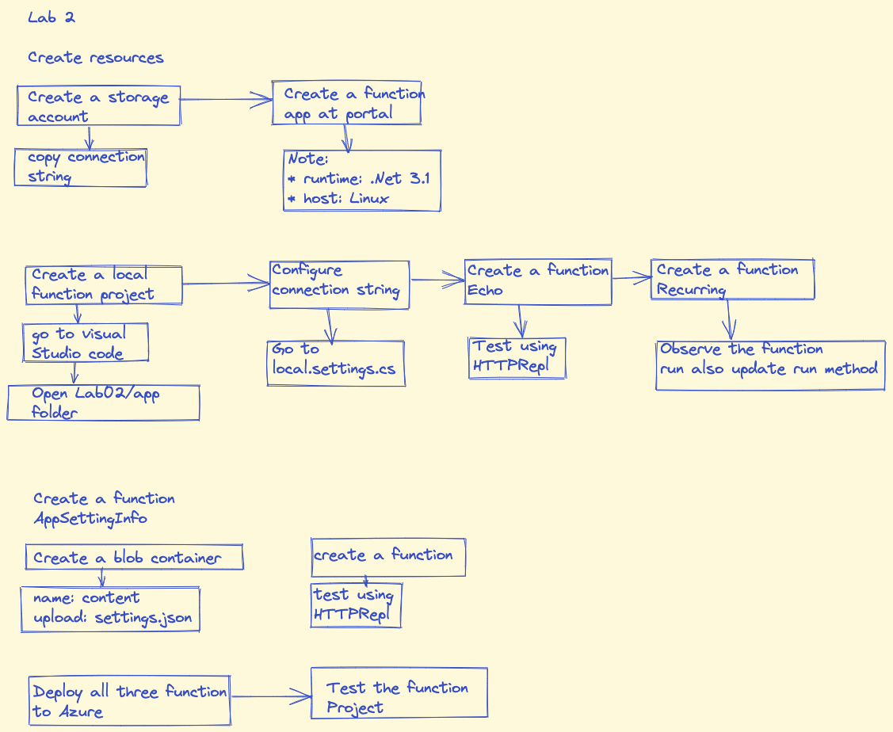

## Lab 2 Build Azure functions using App Services
### Create resources
#### Storage account

* Login to Azure

    ```az login```


* Create a resource group

    `az group create –resource-group  Serverless –location eastus`

* Create a storage account

    ```az deployment group create –resource-group Serverless –parameters storageAccountName=”functionstorepg” –template-uri <storage account uri>```

* Go to portal--> newly created storage account --> Copy connection string 

### Create a Function app
* Search for function app
* Create a function 
* In Basic -> resource group -> enter the name of app -> publish : code -> Runtime stack : .Net -> Version -> 3.1 Region -> east us
* Go to Hosting tab
* Storage account -> your storage account -> OS : linux -> Plan type : Consumption (serverless)
* review and create

## Create a local function project
* In visual studio code open folder

    cd F:\Allfiles\Labs\02\Starter\func
* Execute following command

    ```powershell
    func init –worker-runtime dotnet –force`
    ```

* Go to local.settings.json file

* Update AzureWebJobsStorage with earlier noted connection string

* Save the file
* Go to terminal

    `dotnet build`

* Local function project is created

### Create a function Echo
* Create a new function

    `func new –template “HTTP trigger” –name “Echo”`
* In the Echo.cs file

* Update the code as per instructions and save

* Build the function

    `func start –build`

* Open a new Window Terminal and run following command

    `httprepl http://localhost:7071`

    * There will be an error navigate to following folder 

    `cd api`

    `cd echo`

* Test now posting an integer, string, and json method

```powershell
post –content 3

post –content “Hello”

post –content “{“msg”: “Successful”}”

exit
```


## Create function "Recurring"

* Create a new function
* In VS code, open following folder

    `cd F:\Allfiles\Labs\02\Starter\func`

* Create a function

    ```powershell
    func new --template "Timer trigger" --name "Recurring"
    ```
* Observe function code in Recurring.cs and update the run method as follows

    ```csharp
    public static void Run([TimerTrigger("*/30 * * * * *")
    ```
* Run the updated function, function will be executed every 30 seconds

* Go to the terminal

    ```powershell
    cd F:\Allfiles\Labs\02\Starter\func
    ```
* Build the function

    ```powershell
    func start --build
    ```
## Create Function GetSettingInfo
#### Create a container in the storge account
* Navigate to storage account
* Create a container, name it "content"
* Upload settings.json file in the container from below

    ```powershell
    (F):\Allfiles\Labs\02\Starter, select the settings.json
    ```
#### Create HTTP trigger function 
* Execute followin commands
    ```powershell
     cd F:\Allfiles\Labs\02\Starter\func
    ```
    ```powershell
    func new --template "HTTP trigger" --name "GetSettingInfo"
    ```
* Add code as per instructions

* Add Azur Storage Blob extensions
* Go to 

    ```powershell
    cd F:\Allfiles\Labs\02\Starter\func
    ```

* Run the following command to register the [Microsoft.Azure.WebJobs.Extensions.Storage](https://www.nuget.org/packages/Microsoft.Azure.WebJobs.Extensions.Storage/4.0.4) extension:

    ```powershell
    func extensions install --package Microsoft.Azure.WebJobs.Extensions.Storage --version 4.0.4
    ```

* Build the project

    ```powershell
    dotnet build
    ```


#### Test the function by using httprepl
* Navigate to below directory

    ```powershell
    cd F:\Allfiles\Labs\02\Starter\func
    ```

* In command prompt, run the following command to run the function app project:

    ```powershell
    func start --build
    ```

* On the taskbar, open a new instance of the **Windows Terminal** application
* Run the following command

    ```powershell
    httprepl http://localhost:7071
    ```
* There will an error
* Navigate to following directories

```powershell
cd api
cd getsettinginfo
cd get
```
* Review the returned response and then exit
```powershell
exit
```
Deploy a local function project to an Azure Functions app
Task 1: Deploy using the Azure Functions Core Tools
On the taskbar, select the Windows Terminal icon.

Run the following command to change the current directory to the Allfiles (F):\Allfiles\Labs\02\Starter\func empty directory:

cd F:\Allfiles\Labs\02\Starter\func
When you receive the open command prompt, run the following command to login to the Azure Command-Line Interface (CLI):

az login
In the Microsoft Edge browser window, enter the email address and password for your Microsoft account, and then select Sign in.

Return to the currently open Windows Terminal window. Wait for the sign-in process to finish.

Run the following command to publish the function app project:

func azure functionapp publish <function-app-name>
Note: For example, if your Function App name is funclogicstudent, your command would be func azure functionapp publish funclogicstudent. You can review the documentation to [publish the local function app project][azure-functions-core-tools-publish-azure] using the Azure Functions Core Tools.

Wait for the deployment to finalize before you move forward with the lab.

Close the currently running Windows Terminal application.

Task 2: Validate deployment
On the taskbar, select the Microsoft Edge icon, and select the tab that contains the Azure portal (https://portal.azure.com).

On the Azure portal's navigation pane, select the Resource groups link.

On the Resource groups blade, select the Serverless resource group that you created previously in this lab.

On the Serverless blade, select the funclogic[yourname] function app that you created previously in this lab.

On the App Service blade, select the Functions option in the Functions section.

On the Functions pane, select the existing GetSettingInfo function.

In the Function blade, select the Code + Test option in the Developer section.

In the function editor, select Test/Run.

In the popup dialog that appears, perform the following actions:
In the HTTP method list, select GET.
Select Run to test the function.

Observe the results of the test run. The JSON content should now include the following code:

{
    "version": "0.2.4",
    "root": "/usr/libexec/mews_principal/",
    "device": {
        "id": "21e46d2b2b926cba031a23c6919"
    },
    "notifications": {
        "email": "joseph.price@contoso.com",
        "phone": "(425) 555-0162 x4151"
    }
}
Review
In this exercise, you deployed a local function project to Azure Functions and validated that the functions work in Azure.


