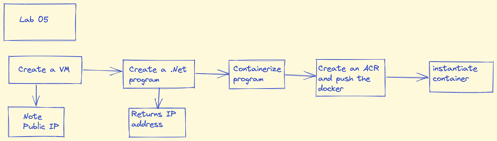

## Lab 5 Build Azure functions using App Services
### Create resources
#### Storage account

* Login to Azure portal

   
* Open cloud shell and create a resource group

    ```powershell
    az group create –-resource-group  ContainerCompute –-location eastus
    ```


* Create a VM 

    ```powershell
    az deployment group create \
    --name vmDeploymentWithARM \
    --resource-group myResourceGroup \
    --template-uri https://raw.githubusercontent.com/Azure/azure-quickstart-templates/master/quickstarts/microsoft.compute/vm-simple-linux/azuredeploy.json
    ```
* List VM public IP, using below command
    ```powershell
    az vm list-ip-addresses --query "[*].virtualMachine.{name: name, nat: network.privateIpAddresses[0], ip: network.publicIpAddresses[0].ipAddress}" -g ContainerCompute -o tsv
    ```
* Login to newly create VM
    ```powershell
    vmadmin@<public IP address>
    ```
### Create .Net Console app and containerize this app

* Execute following commands at cloud shell
    ```powershell
    cd ~/clouddrive
    cd mkdir ipcheck
    cd ipcheck
    dotnet new console --output . --name ipcheck
    touch Dockerfile
    code .
    ```
* Once grphical interface opens, update the Program.cs with the provided code

    ```
     dotnet run
    ```
* Atleast, one ip address will be returned
* Update Dockerfile with provided code

### Create a container registry resource

* Go to portal and create a container registry
    * Resource group
    * Unique registry name
    * Basic
* Once registry is created, run following commands to store registry name in a variable
    ```powershell
    az acr list --query "max_by([], &creattionDate).name" --output tsv

    acrName = $(az acr list --query "max_by([], &creattionDate).name" --output tsv)

    echo $acrName
    ```
### Depoly the container to the newly created registry
* Open a cloud shell

    ```powershell
    cd ~/clouddrive/ipcheck
    dir
    az acr build --registry $acrName --image ipcheck:latest . 
    ```
* Now, go to container registry and in the repositories, check for ipcheck container

### Deploy the container image to a container instance

* Go to Azure portal --> Resource groups --> ContainerCompute1
* ContainerCompute1 --> container registry --> select Update
* Update container registry blade --> Admin user --> select Enable
* Select Save, and then close the Update container registry blade

* In the repository section do the following
    * Services --> repositories --> ipcheck --> latest tag --> elipses --> run instance
* Verify that container is running

### Clear resources
* Execute following
    ```powershell
    az gruop delete --resource-group ContainerCompute1 --no-wait --yes
    ```


