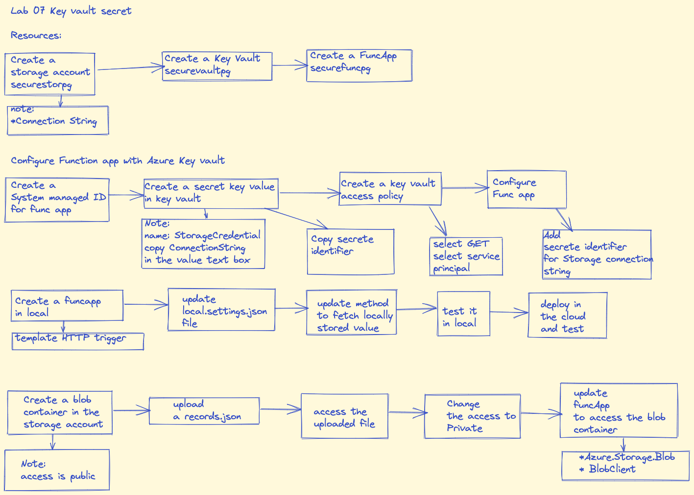

## Lab 7 Accessing Key vault secreate
### Create resources
#### Storage account

* Login to Azure portal

   
* Open cloud shell and create a resource group

    ```powershell
    az group create –-resource-group  ConfidentialStack –-location eastus
    ```


* Create a Storage Account

    ```powershell
    az deployment group create --resource-group ConfidentialStack --parameters storageAccountName="securestorepg" --template-uri "<template-uri Link>"
    ```
* Go to portal and copy connection string for create storage account

#### Create a Key Vault
* from Azure vault --> Create a kay vault --> resource group : ConfidentialStack --> name : securevaultpg --> create

#### Create a function app
* Execute following

    ```powershell
    az functionapp create --consumption-plan-location eastus --name securefuncpg1 --os-type Linux --resource-group ConfidentialStack --runtime dotnet --storage-account securestorepg --functions-version 3
    ```
#### Configure function app and key vault
* Go to resource group --> select function app --> settings --> identity --> system assigned --> status on --> save

* Go to resource group --> select your key vault --> settings --> secrets --> Generate/Import 

* Enter following on the next screen
 manual --> name: storagecredentials --> vaule: "< paste earlier copied secret value >" --> save
* Go back to secret pane --> secrets --> select the latest version --> on the next screen review --> copy secret indentifier value

* Configure Access policy
* Resource group --> your key vault --> settings --> Access policies --> Add Access Policy 
* Add access policy, update following
Secret permission : Get
Select principal : < your function name > 
* Save
* Create a key vault derived setting
* Go to resource group --> select securefuncpg1 --> settings --> configurations --> Application settings --> select New applicaiton setting
* Enter following:
    * name: StorageConnectionString
    * value: @Microsoft.KeyVault(SecretUri=*Secret Identifier*)
### Create a local function app

* Open VS code
* Move to cd F:\Allfiles\Labs\07\Starter\func
* Initialize a function
    ```powershell
    func init --worker-runtime dotnet --force
    ```
* Build the function
    ```
    dotnet build
    ```
* Create a HTTP triggered function
    ```powershell
    func new --template "HTTP trigger" --name "FileParser"
    ```
* Configure the app to read local settings
* In the VS code, go to local.settings.json file
* Values --> add "StorageConnectionString": "[TEST VALUE]"
* Do not change any existing value
* Save file
* Open FileParser.cs and update the code as per provided code
* Open Integrated Terminal and navigate to F:\Allfiles\Labs\07\Starter\func and run following command
    ```powershell
    func start --build
    ```
* Once the build is complete, note the listing port number
* Open a new terminal window and execute following, you will get an error and then execute next commands

    ```powershell
    httprepl https://localhost:7071

    cd api
    cd FileParser
    get
    ```
* You should see [Test Value]

### Deploy the function using Azure Functions Core tools

* In VS Code, navigate to F:\Allfiles\Labs\07\Starter\func and run following command

    ```powershell
  func azure functionapp publish securefuncpg1
    ```
* Validate the function
* In Azure portal, go to resource group --> securefuncpg1 --> functions --> select FileParser function
* In the function blade, Code + Test --> test/run 
* In the HTTP method drop down, select GET and run to test the function
* Function should retrieve stored value in the key vault

### Upload a file in the storage account and access that file
* In the storage account, create a blob container
* Container name "drop"
* Access - public anonymous read access
* Once container is created, upload a json file
* Go to browser and access the file, should be available 
* Come back and change the access level to Private No anonymous access
* Try again accessing the file, you should get an error

### Update the FileParser program to access the file
* Go back to VS code, open the function
* Add Azure.Storage.Blob package
* Update FileParser.cs file so it can access data from the container
* Publish update function to Azure 
* In terminal window
    ```powershell
    Func azure functionapp publish securefuncpg1
    ```
* Once function is published, follow the process to validate, you should be able to access file from the container

### Clear resources
* Execute following
    ```powershell
    az gruop delete --resource-group ConfidentialStack --no-wait --yes
    ```


